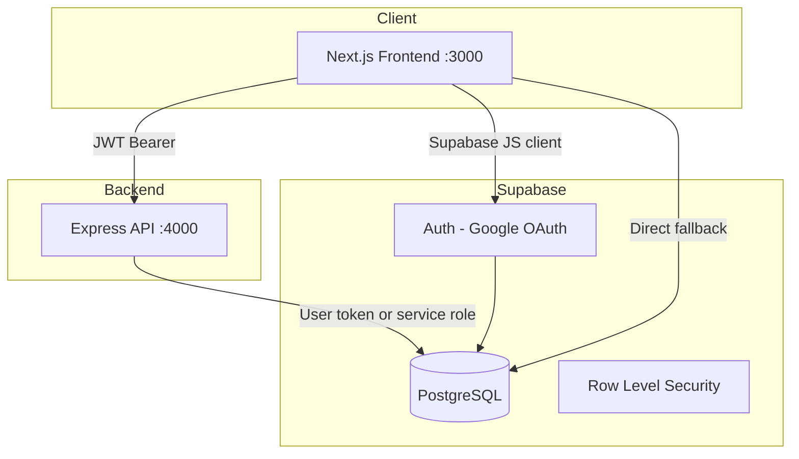

# KARA — Product Documentation

**Version:** 0.1.0  
**Last updated:** May 2026  
**Repository:** https://github.com/VaibhavPandey712/KARA

---

## Table of contents

1. [Executive summary](#1-executive-summary)
2. [Vision & mission](#2-vision--mission)
3. [Problem statement](#3-problem-statement)
4. [Solution & value proposition](#4-solution--value-proposition)
5. [Target audience](#5-target-audience)
6. [Product offerings](#6-product-offerings)
7. [User journeys](#7-user-journeys)
8. [Free creator audit](#8-free-creator-audit)
9. [Onboarding questionnaire](#9-onboarding-questionnaire)
10. [Subscription plans](#10-subscription-plans)
11. [Website & application pages](#11-website--application-pages)
12. [Technical architecture](#12-technical-architecture)
13. [Data model](#13-data-model)
14. [API reference](#14-api-reference)
15. [Authentication & security](#15-authentication--security)
16. [Team](#16-team)
17. [Deployment & operations](#17-deployment--operations)
18. [Roadmap vision](#18-roadmap-vision)

---

## 1. Executive summary

**KARA** is an AI-powered content operations platform built for creators. It positions itself as *the operating system for the creator economy* — helping creators manage, repurpose, distribute, and grow content across major platforms from a single system.

The current product (v0.1) includes:

- A **marketing website** with product education, team, and conversion CTAs
- **Google OAuth** sign-in via Supabase
- A **free personalized creator audit** funnel (multi-step onboarding form)
- A **plans page** with three paid tiers (Lite, Pro, Elite)
- A **monorepo** with separate **frontend** (Next.js) and **backend** (Express API)

**Tagline:** *Create once. AI handles the rest.*

---

## 2. Vision & mission

### Long-term vision

KARA aims to become the **operating system for the creator economy**. In the future, a creator uploads one piece of content and an AI-powered team automatically:

- Edits and repurposes it
- Distributes it across platforms
- Analyzes performance
- Optimizes the next piece of content
- Plans what to create next

Creators focus on **creativity**; KARA handles **content operations**.

### Mission (current)

Help creators escape fragmented tools, expensive teams, and manual workflows by offering:

- One connected workflow instead of 5–10 disconnected apps
- AI-assisted + human-refined content production
- Data-backed decisions instead of guesswork
- A clear path from free audit → paid growth plans

---

## 3. Problem statement

Creators today face systemic operational pain:

| Pain point | Description |
|------------|-------------|
| **Too many tools** | Editing, scheduling, analytics, and design live in separate apps with no central system |
| **Too many team members** | Editors, writers, designers, and strategists add cost and coordination overhead |
| **Too much manual work** | Repurposing, captions, and per-platform formatting consume hours every week |
| **Too many dashboards** | Analytics are scattered across YouTube Studio, Instagram Insights, TikTok, etc. |
| **Not enough time to create** | Operations crowd out creativity and deep work |

### Traditional approach vs KARA

| Traditional way | KARA way |
|-----------------|----------|
| Hire multiple people separately | One AI-assisted content team |
| Use 5–10 disconnected tools | One connected workflow |
| Manually coordinate everyone | Faster repurposing and delivery |
| Hours checking raw analytics | Data-backed content decisions |
| Guess what to post next | Clear weekly strategy and plan |
| High cost, slow, hard to scale | More time, less cost, faster growth |

---

## 4. Solution & value proposition

### Core value pillars

1. **Save time** — Less operations, more creativity  
2. **Reduce team cost** — No need to hire a full in-house content team  
3. **Post consistently** — Steady publishing across platforms  
4. **Grow smarter** — Decisions backed by analytics, not gut feeling  
5. **Repurpose more** — One long video → many clips and posts  
6. **Understand analytics** — Plain-language insights, not raw dashboards  

### Service capabilities (full product vision)

KARA is designed to deliver nine integrated service areas:

1. **Content strategy & planning** — Calendars, trends, competitor research, hooks  
2. **Script & idea development** — Scripts, outlines, retention-focused structure  
3. **Video repurposing** — Long-form → Reels, Shorts, TikTok, LinkedIn clips  
4. **Video editing support** — AI-assisted + human-refined edits  
5. **Thumbnail & creative direction** — CTR-focused visuals  
6. **Caption, title & description writing** — Platform-optimized copy and hashtags  
7. **Multi-platform publishing & scheduling** — YouTube, Instagram, TikTok, LinkedIn, X  
8. **Community & comment management** — Engagement and content ideas from feedback  
9. **Analytics & performance reports** — Actionable weekly insights  
10. **Growth strategy** — Strategist-led recommendations for next content  

### How KARA works (5-step workflow)

```
Upload content → Plan system → Create & repurpose → Publish & manage → Analyze & improve
```

| Step | Title | Description |
|------|--------|-------------|
| 01 | Upload or share content | YouTube video, podcast, webinar, stream, course, or rough idea |
| 02 | Plan the content system | Clips, captions, thumbnails, formats, distribution plan |
| 03 | Create & repurpose | Short-form videos, captions, thumbnails, platform-ready posts |
| 04 | Publish & manage | Schedule across YouTube, Instagram, TikTok, LinkedIn, X |
| 05 | Analyze & improve | Performance data → clear recommendations for next content |

---

## 5. Target audience

### Primary creator types

- YouTubers  
- Instagram creators  
- Podcasters  
- Coaches & educators  
- Startup founders & business creators  
- Tech creators  
- Personal brands  
- Influencers  

### Ideal customer profile

- Creates content on **one or more** major platforms  
- Struggles with **consistency**, **repurposing**, or **growth**  
- Wants professional support without building a large team  
- Open to **AI-assisted** workflows with human quality control  
- Based primarily in **India** (pricing in ₹; WhatsApp for plan inquiries)  

---

## 6. Product offerings

### 6.1 Free tier — Creator audit

- **Price:** Free  
- **Limit:** One audit per user account  
- **Deliverable:** Personalized growth report within **24 hours**  
- **Includes:** Profile audit, content review, consistency analysis, growth map, 7-day action plan  

### 6.2 Paid tiers — Monthly subscriptions

See [Section 10](#10-subscription-plans) for full feature comparison.

### 6.3 Conversion path

```
Landing page → Free audit CTA → Google sign-in → Onboarding (9 steps) → Thank you → Plans page → WhatsApp inquiry
```

---

## 7. User journeys

### 7.1 New visitor (not signed in)

```mermaid
flowchart LR
  A[Homepage] --> B{Click Get Free Audit}
  B --> C[/auth]
  C --> D[Google OAuth]
  D --> E[/auth/callback]
  E --> F[/onboarding]
  F --> G[Submit form]
  G --> H[/thank-you]
  H --> I[/plans optional]
```

1. Lands on homepage (`/`)  
2. Clicks **Get My Free Audit** (Hero, Navbar, or CTA section)  
3. Redirected to `/auth`  
4. Signs in with **Google**  
5. OAuth callback → `/onboarding`  
6. Completes 9-step questionnaire (~2 minutes)  
7. Sees `/thank-you` confirmation  
8. May visit `/plans` to explore paid options  

### 7.2 Returning user (signed in, audit not completed)

1. Clicks audit CTA → routed directly to `/onboarding`  
2. Completes and submits audit → `/thank-you`  

### 7.3 Returning user (signed in, audit already completed)

1. Clicks audit CTA → routed to `/plans`  
2. Onboarding page also redirects to `/plans` if audit exists  
3. Can select a plan → opens **WhatsApp** with pre-filled message  

### 7.4 Auth page behavior

- If **no session:** show Google sign-in  
- If **session exists:** auto-redirect to `/onboarding` or `/plans` based on audit status  

---

## 8. Free creator audit

### What the user receives

| Deliverable | Description |
|-------------|-------------|
| Profile & bio audit | Review of public profile presentation |
| Content quality review | Assessment of existing content |
| Consistency analysis | Posting patterns and gaps |
| Growth opportunity map | Where to focus for growth |
| 7-day action plan | Short-term actionable steps |

### Business rules

- **One audit per user** — enforced by counting rows in `creator_audits` for `user_id`  
- `profiles.audit_used` flag synced when audit exists or is submitted  
- Duplicate submissions blocked (409 from API / client-side check)  
- Team delivers report within **24 hours** via contact method provided (WhatsApp or email)  

### Optional social access requests

On the final onboarding step, users can request deeper access (optional):

- Instagram  
- YouTube  
- LinkedIn  
- X (Twitter)  

These are stored as boolean flags (`social_*_requested`); actual OAuth connections are future scope.

---

## 9. Onboarding questionnaire

**Route:** `/onboarding`  
**Steps:** 9 (step 0 = welcome, steps 1–9 = data collection)  
**Estimated time:** Under 2 minutes  

### Step-by-step breakdown

| Step | Topic | Required fields |
|------|--------|-----------------|
| 0 | Welcome | Continue only |
| 1 | Name | Full name |
| 2 | Main platform | Instagram, YouTube, LinkedIn, X, Podcast, Multiple |
| 3 | Profile link | URL or @username |
| 4 | Niche | Fitness, Fashion, Gaming, Education, Tech, Finance, Food, Travel, Comedy, Beauty, Business, Personal Brand, Other (+ free text) |
| 5 | Biggest problems | Multi-select + optional “other” |
| 6 | Improvement goals | Multi-select + optional “other” |
| 7 | Help needed from KARA | Multi-select + optional “other” |
| 8 | Contact | WhatsApp number or email |
| 9 | Social connect + notes | Optional platform requests + free-text note |

### Problem options (step 5)

Low views, not getting followers, no content ideas, inconsistent posting, poor editing quality, weak captions/hooks, low engagement, don't understand analytics, not getting brand deals, not sure what is wrong.

### Improvement options (step 6)

Grow followers, increase views, improve content quality, post consistently, build personal brand, get brand deals, understand analytics, monetize content.

### Help options (step 7)

Content ideas, caption/hook writing, profile improvement, posting calendar, analytics review, video editing, growth strategy, full creator management.

---

## 10. Subscription plans

**Route:** `/plans` (requires authentication)  
**Currency:** INR (₹) per month  
**Purchase flow:** WhatsApp deep link with pre-filled plan message  

### Plan comparison

| Feature | KARA Lite | KARA Pro | KARA Elite |
|---------|-----------|----------|------------|
| **Price** | ₹4,999/mo | ₹12,999/mo | ₹24,999/mo |
| **Tagline** | Just getting started | Serious creators scaling up | Full content ops, fully managed |
| **Platforms** | 1 | 3 | All |
| **Posts/month** | Up to 8 | Up to 20 | Unlimited |
| **Video repurposing** | 4 basic clips | 12 full clips | Unlimited |
| **Captions & copy** | Caption & hashtags | Caption, title & description | Full copywriting suite |
| **Content calendar** | Monthly | Weekly | Daily planning |
| **Analytics** | Basic summary | Full report | Weekly + strategy calls |
| **Video editing** | ✗ | ✓ | Priority |
| **Thumbnails** | ✗ | 8/month | Unlimited |
| **Dedicated strategist** | ✗ | ✗ | ✓ |
| **Multi-platform publishing** | ✗ | ✓ | ✓ + scheduling |

**Most popular:** KARA Pro  

---

## 11. Website & application pages

| Route | Type | Purpose |
|-------|------|---------|
| `/` | Public | Marketing homepage (all sections) |
| `/auth` | Public | Google sign-in for audit |
| `/auth/callback` | Server | OAuth code exchange, redirect to onboarding |
| `/onboarding` | Protected | 9-step audit questionnaire |
| `/thank-you` | Public | Post-submission confirmation |
| `/plans` | Protected | Pricing and WhatsApp CTA |

### Homepage sections

| Section | ID | Content |
|---------|-----|---------|
| Navbar | — | Navigation, profile, audit CTA |
| Hero | `#home` | Video background, main headline, primary CTA |
| Problem | `#problem` | Creator pain points |
| Services | `#services` | 9 expandable service cards |
| How It Works | `#how-it-works` | 5-step process |
| Why KARA | `#why-kara` | Traditional vs KARA comparison |
| Target Creators | — | Creator types + benefits grid |
| Vision | `#vision` | Long-term product vision |
| Team | `#team` | Leadership profiles |
| CTA | `#contact` | Final conversion block |
| Footer | — | Links and branding |

---

## 12. Technical architecture

### High-level diagram



### Monorepo structure

```
kara/
├── frontend/     Next.js 16, React 19, Framer Motion
├── backend/      Express 4, TypeScript
├── package.json  npm workspaces
└── docs/         Product & technical documentation
```

### Frontend stack

| Technology | Purpose |
|------------|---------|
| Next.js 16 | App Router, SSR, API routes (auth callback) |
| React 19 | UI components |
| TypeScript | Type safety |
| Framer Motion | Animations |
| Lucide React | Icons |
| Supabase SSR | Browser auth client |
| CSS (globals.css) | Design system & component styles |

### Backend stack

| Technology | Purpose |
|------------|---------|
| Express | REST API |
| TypeScript | Type safety |
| @supabase/supabase-js | Database & auth verification |
| cors | Frontend origin allowlist |
| dotenv | Environment configuration |

### Resilience pattern

The frontend uses a **backend-first, Supabase-fallback** pattern:

1. Try Express API for onboarding status and submit  
2. On failure (backend down, network, etc.), call Supabase directly from the browser with the user's session  

This prevents redirect loops and keeps the audit funnel working when the API is unavailable.

---

## 13. Data model

### Table: `profiles`

Stores user profile metadata linked to Supabase Auth.

| Column | Type | Description |
|--------|------|-------------|
| `id` | UUID (PK) | Same as `auth.users.id` |
| `email` | text | User email |
| `full_name` | text | From Google metadata |
| `avatar_url` | text | From Google metadata |
| `audit_used` | boolean | True after first audit submitted |

### Table: `creator_audits`

Stores free audit submissions (one per user enforced in app logic).

| Column | Type | Description |
|--------|------|-------------|
| `user_id` | UUID (FK) | Submitter |
| `name` | text | Display name |
| `platform` | text | Main platform |
| `profile_link` | text | Profile URL or handle |
| `niche` | text | Content niche |
| `biggest_problems` | text[] | Selected pain points |
| `goals` | text[] | Improvement goals |
| `help_needed` | text[] | Services interested in |
| `contact_detail` | text | Phone or email |
| `contact_type` | text | `whatsapp` or `email` |
| `specific_note` | text | Optional creator note |
| `social_ig_requested` | boolean | Instagram access requested |
| `social_yt_requested` | boolean | YouTube access requested |
| `social_tt_requested` | boolean | X/Twitter access requested |
| `social_li_requested` | boolean | LinkedIn access requested |

---

## 14. API reference

**Base URL (local):** `http://localhost:4000`  
**Auth:** `Authorization: Bearer <supabase_access_token>`

### `GET /health`

Health check (no auth).

**Response:** `{ "status": "ok" }`

### `GET /api/onboarding/status`

Returns audit status and ensures profile row exists.

**Response:**

```json
{
  "hasAudit": false,
  "user": { ... }
}
```

**Side effects:**

- If `hasAudit`, updates `profiles.audit_used = true`  
- If no profile row, creates one  

### `POST /api/onboarding/submit`

Submits creator audit form.

**Body:**

```json
{
  "name": "string",
  "platform": "string",
  "profileLink": "string",
  "niche": "string",
  "problems": ["string"],
  "goals": ["string"],
  "helpNeeded": ["string"],
  "contact": "string",
  "contactType": "whatsapp | email",
  "specificNote": "string",
  "igConnected": false,
  "ytConnected": false,
  "ttConnected": false,
  "liConnected": false
}
```

**Responses:**

- `200` — `{ "success": true }`  
- `409` — Audit already submitted  
- `401` — Missing or invalid token  
- `500` — Database or server error  

---

## 15. Authentication & security

### Authentication

- **Provider:** Google OAuth via Supabase Auth  
- **Session:** Browser cookies (SSR package on callback route)  
- **API auth:** JWT access token validated with `supabase.auth.getUser()` on backend  

### Environment secrets

| Location | Variables | Committed? |
|----------|-----------|------------|
| `frontend/.env.local` | `NEXT_PUBLIC_SUPABASE_*`, `NEXT_PUBLIC_API_URL` | No (gitignored) |
| `backend/.env` | `SUPABASE_URL`, `SUPABASE_ANON_KEY`, optional `SERVICE_ROLE_KEY` | No (gitignored) |

### CORS

Backend allows requests from `FRONTEND_URL` (default `http://localhost:3000`) with credentials.

### Data access

- Preferred: user-scoped Supabase client (respects RLS)  
- Optional: service role key for admin operations when RLS blocks writes  

---

## 16. Team

| Name | Role | Focus |
|------|------|--------|
| **Vaibhav Pandey** | Founder & CEO | Vision, strategy, creator partnerships |
| **Sparsh Tyagi** | CTO | Product, AI systems, platform architecture |
| **Yuvraj Singh** | COO | Operations, workflows, delivery |
| **Vaishnavi Rajawat** | CFO | Finance, pricing, business growth |

---

## 17. Deployment & operations

### Local development

```bash
npm install
npm run dev          # frontend :3000 + backend :4000
```

### Production recommendations

| Component | Suggested platform |
|-----------|-------------------|
| Frontend | Vercel, Netlify |
| Backend | Railway, Render, Fly.io |
| Database & Auth | Supabase (hosted) |

### Production environment

- Set `NEXT_PUBLIC_API_URL` to production API URL  
- Set `FRONTEND_URL` on backend for CORS  
- Enable Google OAuth redirect URLs for production domain in Supabase  
- Never expose `SUPABASE_SERVICE_ROLE_KEY` to the frontend  

---

## 18. Roadmap vision

Features implied by marketing copy but not fully automated in v0.1:

- [ ] Automated clip generation from long-form video  
- [ ] Real social account OAuth (Instagram, YouTube, etc.)  
- [ ] In-app analytics dashboards  
- [ ] Content calendar UI  
- [ ] Payment integration (currently WhatsApp-led sales)  
- [ ] Admin panel for audit delivery workflow  
- [ ] Email notifications for audit completion  
- [ ] Multi-language support  

---

## Appendix A — Brand & messaging

| Element | Value |
|---------|--------|
| Product name | KARA |
| Descriptor | The AI Operating System for Creators |
| Hero headline | Your AI-Powered Content Team |
| Primary CTA | Get My Free Audit |
| Auth CTA | Continue with Google |
| Post-audit message | Personalized growth report within 24 hours |

---

## Appendix B — Support & contact

- **Plan inquiries:** WhatsApp (configured on plans page)  
- **Audit delivery:** WhatsApp or email per user choice in onboarding  
- **GitHub:** https://github.com/VaibhavPandey712/KARA  

---

*This document describes the product as implemented in the KARA codebase. Update it when features, pricing, or architecture change.*
